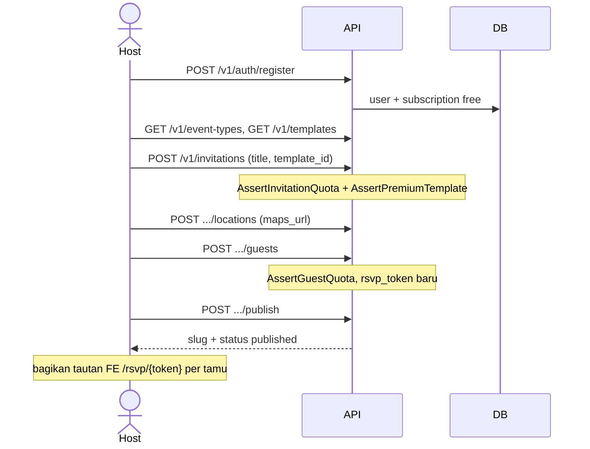
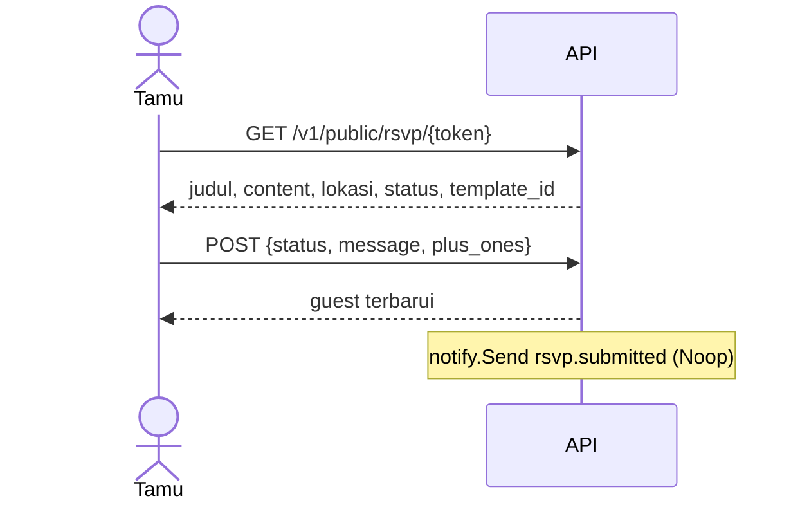

# Cetak biru Ketuk

Dokumen ini adalah peta produk dan teknis Ketuk: **apa yang sudah hidup di first release**, **apa yang sengaja ditunda**, dan **arah modul masa depan**. Keputusan yang sudah dikunci tidak diulang di tempat lain — `AGENTS.md` adalah kontrak agen; dokumen ini adalah cetak biru manusia.

Repo ini = backend Go (`ketuk.id/api`). Frontend Svelte ada di repo terpisah. Kontrak HTTP: `api/openapi.yaml`.

| | |
|---|---|
| Versi API | `0.2.0` |
| Bentuk | Modular monolith, satu binary `cmd/api`, satu Postgres |
| Default plan | `free` saat register |
| Checkout bayar | Hidup (Duitku); tanpa kredensial → `503` |

---

## 1. Produk

Ketuk adalah platform kebutuhan acara yang **modular**. Pengguna tidak dipaksa membeli atau memakai paket lengkap. Seseorang boleh hanya membuat undangan digital, hanya merencanakan budget, atau (nanti) hanya mencari vendor — tanpa harus punya “Event” sebagai induk wajib.

Yang wajib dari katalog adalah **tipe acara** (`event_types`: wedding, birthday, corporate, custom, …). Instance event sebagai parent hierarki **bukan** model domain Ketuk.

```
                    ┌─────────────┐
                    │  Host user  │
                    └──────┬──────┘
           ┌───────────────┼───────────────┐
           ▼               ▼               ▼
    ┌────────────┐  ┌────────────┐  ┌────────────┐
    │  Undangan  │  │  Planner   │  │   Vendor   │  ← mandiri
    └─────┬──────┘  └─────┬──────┘  └────────────┘
          │   opsional    │               ▲
          └───────┬───────┘               │
                  ▼                 (belum di API)
           resource_links
                  │
                  ▼  (nanti, dari undangan yang diterima)
           ┌────────────┐
           │    Gift    │
           └────────────┘
```

### Persona

| Persona | Peran di first release | Nanti |
|---|---|---|
| **Host** | Register, kelola undangan & planner, lihat paket | Bayar upgrade, cari vendor, kirim undangan massal |
| **Tamu** | Buka tautan RSVP per-token, submit hadir/tidak | Kirim Gift, terima reminder D-7 |
| **Vendor** | — | Katalog jasa, dicari tanpa event |
| **Sistem** | Kuota paket, JWT, notify Noop | SMTP/WA, Duitku, pesanan, reminder |

### Tiga kas yang tidak boleh dicampur

1. **Billing host (SaaS)** — langganan Ketuk (free / starter / pro). Fase 6. Tabel `orders`.
2. **Gift / amplop tamu** — uang dari tamu ke host lewat undangan. Modul `gift`, tabel `gift_payments`.
3. **Bayar vendor** — nanti, saat modul Vendor hidup. Bukan fase 6.

Adapter pembayaran **satu**: Duitku di `internal/pay`. Checkout yang berbeda = tabel dan webhook kind yang berbeda. Mencampur kas di satu checkout adalah anti-pola.

---

## 2. Prinsip yang dikunci

| Prinsip | Artinya di kode |
|---|---|
| Modular, bukan event-centric | Undangan dan planner berdiri sendiri; tautan lewat `resource_links`, tanpa cascade hapus di level produk (DB FK cascade hanya menjaga kebersihan baris, bukan “hapus undangan = hapus planner”). |
| Domain tidak saling import | `invitation` ↛ `planner`, `planner` ↛ `invitation`. Hanya `internal/link` yang kenal keduanya. |
| Entitlement, bukan if-plan | Domain memanggil `billing.Assert*` / `RequireInt` / `RequireFlag`. Dilarang `if plan == "pro"`. |
| Port, bukan vendor lock | Notify lewat `notify.Notifier`. Bayar lewat `pay` (Duitku), bukan Duitku langsung dari undangan/planner. |
| RSVP privat | Jalur utama tamu = `/v1/public/rsvp/{token}` per tamu. Bukan slug terbuka sebagai path utama. |
| Lokasi = tempel URL | Simpan `maps_url` (Google/Apple Maps). Tidak geocode di server. Kolom `lat`/`lng` ada di skema untuk masa depan, tidak diisi otomatis. |
| Satu repo API | Bukan monorepo. Tanpa Docker, Redis, MinIO. File lokal `./storage`. |
| Kontrak FE | JSON sukses `{"data": ...}`. Error `{"error":{"code","message"}}`. Kuota/premium → `402` + `entitlement_denied`. Jangan expose skema DB. |

---

## Pohon fitur — undangan · planner · vendor

Sumber kebenaran rencana produk. **Kode belum** untuk baris berstatus Direncanakan / Future. Jangan implement Vendor sampai diminta.

Status: **Hidup** = API ada · **Tipis** = ada tapi CRUD belum lengkap · **Direncanakan** = akan dibuat · **Future** = Vendor, jangan dikerjakan sekarang.

### Penunjang (bukan modul ke-4)

Dipakai ketiga modul. Bukan “Event parent”.

| Fitur | Status | API / catatan |
|---|---|---|
| **Monitoring sistem** | Hidup | `GET /healthz` — cek proses API + ping Postgres; tanpa auth. Bukan fitur host/tamu. |
| Register | Hidup | `POST /v1/auth/register` → plan `free` |
| Login | Hidup | `POST /v1/auth/login` |
| Refresh token | Hidup | `POST /v1/auth/refresh` |
| Logout | Hidup | `POST /v1/auth/logout` — body `{refresh_token}`; cabut satu sesi |
| Dashboard | Tipis | `GET /v1/me` (user + paket + undangan + planner) |
| Katalog tipe acara | Hidup | `GET /v1/event-types` |
| **Pesanan / riwayat transaksi** | Hidup | `GET /v1/orders` — baris SaaS (`kind` subscription); gift via riwayat amplop; vendor nanti |
| **Pembayaran Duitku** | Hidup | Port `internal/pay`; `POST /v1/billing/checkout`; webhook `POST /v1/public/payments/duitku/callback`. Tanpa kredensial → `503 payment_unavailable` |

### 1. Undangan digital

Dipakai sendiri. Kategori dari `event_types` (pernikahan, ulang tahun, lamaran, aqiqah, wisuda, corporate, custom).

| Fitur | Turunan | Status | API / catatan |
|---|---|---|---|
| Buat undangan | Pilih kategori + template | Hidup | `POST /v1/invitations` |
| | List / get / patch / archive | Hidup | `/v1/invitations`, `/{id}` |
| | Publish (isi slug) | Hidup | `POST .../publish` — slug bukan jalur RSVP |
| | Ganti template | Hidup | `PATCH .../template` (ditolak setelah publish) |
| Data pengada acara | Nama host, judul, `content` JSON | Tipis | Slot per tipe (`couple`, `honoree`, …); bukan entitas pengantin terpisah |
| Acara dan lokasi | Venue, alamat, `maps_url` | Hidup | `GET/POST .../locations`, `PATCH/DELETE .../locations/{id}` — tanpa geocode |
| Cerita pasangan | Timeline momen (wedding) | Direncanakan | Slot `story` baru di wedding; entitas momen (tanggal, judul, teks, foto) |
| **Turut mengundang** | Nama yang ikut mengundang, tampil di undangan / konteks tamu | Hidup | `GET/POST .../inviters`, `PATCH/DELETE .../inviters/{id}` — **bukan** tamu RSVP |
| Daftar tamu | Tambah / list / patch / hapus + `rsvp_token` | Hidup | `GET/POST .../guests`, `PATCH/DELETE .../guests/{id}` — host `status` hanya `draft`\|`invited`; kirim email/WA belum |
| Tampilan | Template free/premium | Hidup | Catalog + `AssertPremiumTemplate` |
| **Galeri** | Foto galeri acara | Hidup | `.../gallery` + `./storage`; `GET /v1/public/media/{id}`; `PATCH .../gallery/{mediaId}` untuk caption (file tetap) |
| **Musik** | Audio saat undangan dibuka | Hidup | `.../music` + `./storage`; URL di GET RSVP publik |
| RSVP | Buka + submit per token | Hidup | `GET/POST /v1/public/rsvp/{token}` |
| Preview publik | Halaman undangan by slug | Hidup | `GET /v1/public/invitations/{slug}` — **bukan** RSVP; draft/archived → 404 |
| Ucapan | Pesan tamu di RSVP | Tipis | Field `message` di RSVP |
| **Buku ucapan** | Ucapan terpisah dari RSVP | Hidup | `GET/POST /v1/public/invitations/{slug}/guestbook`, `POST /v1/public/rsvp/{token}/guestbook`; host `GET/PATCH/DELETE .../guestbook` |
| **Amplop hadiah** | Tamu kirim uang ke host | Hidup | Modul `gift`; `POST /v1/public/rsvp/{token}/gifts` → Duitku; kas ≠ paket SaaS |
| Media storage | Upload | Hidup | `./storage` (bukan MinIO) |

### 2. Planner

Dipakai sendiri. Opsional `type_id` kategori. Opsional tautan ke undangan.

| Fitur | Turunan | Status | API / catatan |
|---|---|---|---|
| Buat planner | Pilih kategori kegiatan | Hidup | `POST /v1/planners` |
| | List / get | Hidup | `/v1/planners`, `/{id}` |
| | Patch judul/tanggal + archive | Hidup | `PATCH /{id}` (parsial), `DELETE /{id}` = archive |
| | Mode budget `event` \| `daily` | Hidup | `PATCH /{id}` field `budget_mode` |
| **Budgeting** | Kategori | Hidup | `GET/POST .../categories`, `PATCH/DELETE .../categories/{categoryId}` (hapus = cascade item) |
| | Item + ringkasan total/paid | Hidup | `POST .../budget/items`, `PATCH/DELETE .../budget/items/{itemId}`, `GET .../budget` (sekaligus list item); `paid_at` dikirim FE |
| **Daftar tugas** | Checklist | Hidup | `GET/POST .../checklist`, `PATCH/DELETE .../checklist/{itemId}` — `due_at`, `sort_order`, done |
| **Rundown acara** | Hari | Hidup | `GET/POST .../days`, `PATCH/DELETE .../days/{dayId}`; tanggal ganda → 409 |
| | Sesi jam + PIC | Hidup | `GET/POST .../days/{dayId}/sessions`, `PATCH/DELETE .../sessions/{sessionId}`; jam `"HH:MM"`, `pic_name` teks bebas |
| Tautan ke undangan | `resource_links` | Hidup | `GET/POST/DELETE /v1/links` |
| Vendor | Tautkan jasa ke planner | Future | Lihat modul 3; jangan kode sekarang |

### 3. Vendor — Future (jangan kode sekarang)

Berdiri sendiri: cari jasa **tanpa** wajib punya event/undangan/planner.

| Fitur | Turunan | Status | Rencana API |
|---|---|---|---|
| Cari vendor | Query nama/kategori | Future | `GET /v1/vendors?q=` |
| Browse katalog jasa | Daftar layanan | Future | `GET /v1/vendor-services` |
| Filter | Kebutuhan / tipe acara | Future | Query `event_type`, kota, harga — filter, bukan parent Event |
| Profil vendor | Bio, foto, area | Future | `GET /v1/vendors/{id}` |
| Layanan vendor | Paket, harga, durasi | Future | `GET /v1/vendors/{id}/services` |
| Hubungi / request | Permintaan ke vendor | Future | `POST /v1/vendor-requests` — kas vendor terpisah jika ada bayar |
| Pesanan vendor | Riwayat request/bayar | Future | Masuk `GET /v1/orders?kind=vendor` |

Paket kode nanti: `internal/vendor`. Tidak diimport `invitation` atau `planner`. Tautan opsional mengikuti pola `link`.

---

## 3. First release — ruang lingkup

First release = **API host + RSVP tamu**, cukup untuk flow:

`register → pilih tipe/template → buat undangan → lokasi + tamu → publish → tamu RSVP`

dan secara paralel:

`buat planner (event atau daily) → kategori → item budget → checklist`

lalu opsional: tautkan undangan ↔ planner.

### Modul first release

| Modul | Status | Boleh dipakai sendiri? |
|---|---|---|
| Identity (register/login/refresh/me) | Hidup | — |
| Catalog (`event_types`, template) | Hidup | — |
| Billing (baca paket + kuota + checkout) | Hidup; tanpa kredensial Duitku → `503` | — |
| Undangan digital | Hidup | Ya |
| Planner (budget + checklist) | Hidup | Ya |
| Link undangan↔planner | Hidup | Opsional |
| Notify | Port + `Noop` | — |
| Vendor | Belum | Ya (desain) |
| Gift / amplop | Hidup | Dari undangan yang diterima (kas ≠ SaaS) |

### Yang sengaja tidak masuk first release (kode)

Direncanakan di pohon fitur, **belum dikode**:

- Cerita pasangan sebagai timeline
- Kirim email / WhatsApp / reminder D-7
- Reset password via email, verifikasi email, hapus akun
- Cancel / downgrade langganan; baris `gift` / `vendor` di `orders` (kolom `kind` sudah ada, penulisnya belum)
- Import CSV tamu
- Modul Vendor (rencana tercatat)
- Geocoding berbayar
- Docker, Redis, MinIO
- RSVP terbuka by slug sebagai jalur utama (preview slug sudah ada; submit RSVP tetap token)

---

## 4. First release — arsitektur

Modular monolith: satu proses, paket Go yang tidak boleh saling merembes.

```
 FE Svelte (repo lain)          Tamu (browser)
        │                              │
        │ JWT Bearer                   │ tanpa auth
        ▼                              ▼
 ┌──────────────────────────────────────────────┐
 │                 cmd/api                      │
 │  config → db → migrate? → services → HTTP    │
 └──────────────────────────────────────────────┘
        │
        ▼  Chi + CORS
 internal/httpserver          ← decode JSON, JWT, routing
        │
        ├── identity          register, login, refresh, logout, me
        ├── catalog           event types, templates
        ├── billing           plans, subscription, Assert*, checkout, orders
        ├── pay               Duitku (satu-satunya yang bicara gateway)
        ├── invitation        undangan, lokasi, tamu, RSVP, galeri, musik
        ├── gift              amplop (boleh import invitation)
        ├── planner           budget, hari, checklist
        ├── link              resource_links (satu-satunya jembatan)
        └── notify            Notifier; hari ini Noop
```

Wiring di `cmd/api/main.go`:

`config.Load` → `db.Connect` → (opsional `migrate.Up`) → `identity` / `pay` / `billing` / `catalog` / `invitation` / `planner` / `link` / `gift` → `httpserver.New`

`invitation.New(..., notify.Noop{}, storageDir)`.

### Stack

| Lapisan | Pilihan |
|---|---|
| Bahasa | Go 1.23+ |
| HTTP | chi, chi/cors |
| DB | Postgres + pgx pool |
| Migrasi | goose, SQL embed di `internal/migrate/sql` |
| Auth | JWT HS256 (access + refresh), bcrypt cost 12 |
| ID | UUID |
| Uang | `bigint` IDR |
| File | `./storage` (galeri + musik hidup) |

Migrasi jalan saat start jika `MIGRATE_ON_START=true`. Seed paket/tipe/template: `006_seed.sql`.

### Batas paket (composition)

HTTP **tidak** berisi SQL bisnis. Domain **tidak** memanggil SMTP/Duitku. Billing **tidak** tahu cara undangan dirender. Link **hanya** memverifikasi ownership kedua sisi lalu menulis `resource_links`. `pay` adalah satu-satunya yang bicara ke Duitku.

---

## 5. First release — model data

### Identitas & paket

```
users 1──1 subscriptions *──1 plans
                              │
                              └── plan_entitlements (key/value)
```

- Email unik case-insensitive.
- Register membuat user + subscription `free` dengan `current_period_end` jauh ke depan (placeholder sampai fase 6).
- Paket seed: `free` (0), `starter` (79.000/bulan), `pro` (199.000/bulan). Harga di DB. Checkout SaaS: `POST /v1/billing/checkout` lewat Duitku; tanpa kredensial → `503 payment_unavailable`.

### Katalog

```
event_types 1──* invitation_templates
```

`event_types` membawa:

- `invitation_schema` — slot konten undangan (couple, rundown, …)
- `planner_categories` — default kategori budget saat planner dibuat dengan `type_id`

Template punya `tier` `free` | `premium` dan `slots` JSON.

Tipe seed: wedding, engagement, birthday, aqiqah, graduation, corporate, custom.

### Undangan

```
invitations
  ├── invitation_locations   (maps_url tempelan)
  ├── invitation_guests      (rsvp_token unik per tamu)
  ├── invitation_inviters    (turut mengundang; bukan tamu RSVP)
  ├── invitation_media       (gallery + satu music; ./storage)
  └── invitation_guestbook   (terpisah dari message RSVP)
```

Status undangan: `draft` → `published` → `archived`.

Publish mengisi `slug` unik dari judul + prefix UUID. Slug **bukan** jalur RSVP utama; disimpan untuk identitas publik nanti / FE.

Status tamu: `draft` | `invited` | `opened` | `accepted` | `declined`.

Buka GET RSVP (undangan sudah published) menaikkan `draft`/`invited` → `opened`. POST RSVP menulis `accepted`/`declined` + pesan + plus_ones.

### Planner

```
planners
  ├── planner_days
  │     └── planner_sessions  (jam TIME + pic_name; CASCADE ikut hari)
  ├── budget_categories
  │     └── budget_items  (opsional day_id)
  └── checklist_items     (opsional day_id)
```

- `budget_mode`: `event` (satu ember) atau `daily` (item bisa menempel hari). Mode `daily` dicek flag `planner_daily`.
- Turun dari `daily` ke `event` mengosongkan `day_id` pada item.
- Mata uang default `IDR`. Status `active` | `archived`.
- Sesi rundown menempel hari, bukan planner: kolom `TIME` (`starts_at` wajib, `ends_at` boleh null), `pic_name` teks bebas. Hapus hari **menghapus** sesinya, beda dari item/checklist yang hanya kehilangan `day_id`.
- Saat create, kategori bisa dikirim FE atau di-copy dari `event_types.planner_categories`.

### Tautan

```
resource_links (invitation_id, planner_id) UNIQUE
```

Opsional, many-to-many. Hapus tautan **tidak** menghapus undangan atau planner.

---

## 6. First release — alur pengguna

### Host: undangan



### Tamu: RSVP



Tamu **tidak** login. Token salah atau undangan belum published → 404.

### Host: planner mandiri

1. `POST /v1/planners` dengan `budget_mode` `event` atau `daily`, opsional `type_id`.
2. Tambah hari (untuk mode daily), kategori, item budget, checklist.
3. `GET /v1/planners/{id}/budget` mengembalikan total, paid, kategori + item. Ubah/hapus item, tandai `paid_at`, ganti judul/tanggal, archive lewat `DELETE /v1/planners/{id}`.
4. Opsional `POST /v1/links` mengikat ke undangan yang sudah ada — atau tidak sama sekali.

### Host: me

`GET /v1/me` menggabungkan profil, subscription, daftar undangan non-archived, daftar planner active. Ini dashboard ringkas first release.

---

## 7. First release — peta API

Prefix `/v1`. Sukses: `{"data": ...}`. Auth register/login: `data` + `tokens`. Refresh: `tokens` saja.

Peta lengkap (termasuk gift, media, PATCH anak): `docs/api.md`. Ringkasan first-release di bawah.

| Area | Method | Path | Auth |
|---|---|---|---|
| Health / monitoring | GET | `/healthz` | — |
| Auth | POST | `/auth/register` `/login` `/refresh` `/logout` | — |
| Password | POST | `/auth/password` | JWT |
| Me | GET/PATCH | `/me` | JWT |
| Catalog | GET | `/event-types` `/templates?type=` | publik; template `locked` jika premium & bukan subscriber |
| Billing | GET | `/billing/plans` | — |
| Billing | GET | `/billing/subscription` | JWT |
| Checkout | POST | `/billing/checkout` | JWT; tanpa Duitku → `503` |
| Pesanan | GET / POST | `/orders?kind=` `/orders/{id}/sync` | JWT |
| Undangan | GET/POST | `/invitations` | JWT |
| Undangan | GET/PATCH/DELETE | `/invitations/{id}` | JWT (DELETE = archive) |
| Publish | POST | `/invitations/{id}/publish` | JWT |
| Template | PATCH | `/invitations/{id}/template` | JWT; ditolak setelah published |
| Lokasi | GET/POST + PATCH/DELETE | `/invitations/{id}/locations` `.../{locationId}` | JWT |
| Tamu | GET/POST + PATCH/DELETE | `/invitations/{id}/guests` `.../{guestId}` | JWT |
| Inviters | GET/POST + PATCH/DELETE | `/invitations/{id}/inviters` `.../{inviterId}` | JWT |
| Galeri | GET/POST + PATCH/DELETE | `/invitations/{id}/gallery` `.../{mediaId}` | JWT; PATCH = caption |
| Musik | GET/PUT/DELETE | `/invitations/{id}/music` | JWT |
| Amplop host | GET/POST + DELETE | `/invitations/{id}/gift-methods` `.../{methodId}`; GET `.../gifts` | JWT |
| Buku ucapan host | GET + PATCH/DELETE | `/invitations/{id}/guestbook` `.../{entryId}` | JWT |
| RSVP | GET/POST | `/public/rsvp/{token}` | — |
| Preview undangan | GET | `/public/invitations/{slug}` | — |
| Buku ucapan publik | GET/POST | `/public/invitations/{slug}/guestbook` | — |
| Buku ucapan tamu | POST | `/public/rsvp/{token}/guestbook` | — |
| Amplop tamu | POST | `/public/rsvp/{token}/gifts` | — |
| Media publik | GET | `/public/media/{id}` | — |
| Planner | GET/POST | `/planners` | JWT |
| Planner | GET/PATCH/DELETE | `/planners/{id}` | JWT (PATCH parsial; DELETE = archive) |
| Hari | GET/POST + PATCH/DELETE | `/planners/{id}/days` `.../{dayId}` | JWT; tanggal ganda → 409 |
| Sesi rundown | GET/POST + PATCH/DELETE | `/planners/{id}/days/{dayId}/sessions` `.../{sessionId}` | JWT; jam `"HH:MM"`/`"HH:MM:SS"` |
| Kategori | GET/POST + PATCH/DELETE | `/planners/{id}/categories` `.../{categoryId}` | JWT; DELETE cascade ke item |
| Budget | GET | `/planners/{id}/budget` | JWT; ringkasan sekaligus list item |
| Item | POST + PATCH/DELETE | `/planners/{id}/budget/items` `.../{itemId}` | JWT |
| Checklist | GET/POST | `/planners/{id}/checklist` | JWT |
| Checklist | PATCH/DELETE | `/planners/{id}/checklist/{itemId}` | JWT; PATCH 200 + body |
| Link | GET/POST | `/links` | JWT |
| Link | DELETE | `/links/{id}` | JWT |

OpenAPI di `api/openapi.yaml`: schema katalog + undangan + planner sudah diisi. Auth/billing masih path + summary. Perilaku = handler + service.

### Error

| HTTP | Kode tipikal |
|---|---|
| 400 | `invalid_input`, `invalid_id`, `weak_password` |
| 401 | `unauthorized` |
| 402 | `entitlement_denied` |
| 404 | `not_found` |
| 409 | `email_taken`, `immutable` |

---

## 8. First release — billing + checkout Duitku

Paket adalah **katalog kuota**. Checkout host hidup di `POST /v1/billing/checkout` lewat `internal/pay`; tanpa kredensial → `503 payment_unavailable` (baris `orders` tetap tertulis berstatus `failed`).

| Key | Free | Starter | Pro | Dipakai di |
|---|---|---|---|---|
| `max_active_invitations` | 1 | 5 | −1 (unlimited) | `AssertInvitationQuota` (status ≠ archived) |
| `max_guests_per_invitation` | 50 | 300 | 2000 | `AssertGuestQuota` |
| `premium_templates` | false | true | true | `AssertPremiumTemplate` |
| `planner_daily` | true | true | true | `AssertPlannerDaily` |
| `max_active_planners` | 1 | 5 | −1 (unlimited) | `AssertPlannerQuota` (`planner.Create`) |

Limit `< 0` = unlimited.

Yang host lihat hari ini: daftar paket + entitlement miliknya, plus checkout Duitku jika kredensial di `.env`.

---

## 9. First release — celah yang sadar

Bukan bug tersembunyi; backlog sebelum fitur baru:

| Area | Ada | Belum / tipis |
|---|---|---|
| Lokasi | create, list, patch parsial, hapus | — |
| Tamu | create, list, patch, hapus, tandai `invited` | kirim undangan (butuh notify nyata) |
| Turut mengundang | create, list, patch, hapus | — |
| Galeri | upload, list, patch caption, hapus | ganti file, reorder |
| Budget item | create, patch, hapus, `paid_at`, ringkasan `GET .../budget` | — (jangan tambah list item terpisah) |
| Planner | create, get, patch judul/tanggal/mode, archive | unarchive, mata uang selain IDR |
| Checklist | create, list, patch (done/due_at/urutan), hapus | — |
| Hari planner | create, list, patch, hapus | — |
| Sesi rundown | create, list, patch, hapus (jam + PIC); hapus hari = CASCADE | reorder massal |
| Link | create, list, delete | — |
| Undangan publik | RSVP by token + preview by slug | — |
| Amplop | methods GET/POST/DELETE, list payments, POST tamu | PATCH method; `orders.kind=gift` |
| Akun | register, login, rotasi refresh, logout, ganti password, patch nama | reset password via email, verifikasi email, hapus akun |
| Pesanan | checkout, list `?kind=`, `POST /orders/{id}/sync`, sweep `expired` | baris `gift`/`vendor`, cancel/downgrade langganan |
| Tes | unit (slug, auth, Duitku, rate limit, sesi refresh, buku ucapan, status tamu, patch inviter/caption, patch planner, patch sesi rundown) + manual ke Postgres (penunjang, CRUD undangan, CRUD planner bagian 1, rundown sesi) | tes HTTP/integrasi sebagai kode yang bisa diulang di CI |
| OpenAPI | path + schema katalog/undangan/planner | schema auth/billing (masih path-only) |
| Storage | folder di-create saat start; galeri + musik jalan | — |
| Notify | dipanggil saat RSVP | tidak ada saluran nyata |

Prioritas next work (dari `AGENTS.md`):

1. ~~Postgres lokal~~ selesai.
2. Tes HTTP/integrasi sebagai kode (alur manual sudah ada; CRUD planner belum diuji ke Postgres).
3. ~~CRUD tipis undangan~~ selesai. ~~Rapatkan planner bagian 1~~ selesai. ~~Rundown sesi jam+PIC~~ selesai (migrasi `014`).
4. Schema OpenAPI auth / billing (katalog, undangan, planner sudah).
5. Cerita pasangan, kirim undangan, Vendor terakhir.

---

## 10. Future — peta fase

Urutan ini mengikuti keputusan yang sudah dikunci. Jangan loncat ke Vendor sebelum diminta. Amplop + checkout Duitku **sudah hidup** (kas tetap terpisah).

```
 sekarang                     tes / OpenAPI sisa      cerita / kirim         Vendor
 ┌──────────────┐           ┌──────────────┐     ┌──────────────┐     ┌─────────┐
 │ Undangan CRUD│ ────────► │ Tes HTTP/CI  │ ──► │ Timeline     │ ──► │ Cari /  │
 │ Planner CRUD │           │ OpenAPI auth │     │ email/WA     │     │ katalog │
 │ + rundown    │           │ + billing    │     │ CSV tamu     │     │ request │
 │ RSVP+preview │           │              │     │              │     └─────────┘
 │ Gift+Duitku  │           └──────────────┘     └──────────────┘
 └──────────────┘
```

Fase tidak harus rilis publik terpisah; ini urutan kerja backend.

---

## 11. Future — rapatkan first release

Selesai jika host bisa mengelola undangan dan planner tanpa celah CRUD, dan flow RSVP teruji otomatis.

- ~~Patch/hapus lokasi dan tamu; tandai tamu `invited` (siap kirim).~~
- ~~List links.~~
- ~~Patch/hapus budget item, tandai `paid_at`.~~
- ~~Archive planner; hapus checklist / due.~~
- ~~Rundown sesi jam + PIC di bawah hari planner.~~
- Tes integrasi sebagai kode: register, kuota 402, publish, RSVP, preview slug, buku ucapan, link, CRUD planner.
- OpenAPI auth/billing agar FE Svelte tidak menebak body (undangan + planner sudah).
- Setelah itu: cerita pasangan, kirim undangan, lalu Vendor.

---

## 12. Pesanan + Duitku — hidup (sisa: baris kind gift/vendor, cancel langganan)

Checkout SaaS dan webhook sudah ada. Yang belum: menulis `orders.kind=gift`/`vendor`, cancel/downgrade langganan, audit webhook.

| Keputusan | Detail |
|---|---|
| Port | `internal/pay` — satu-satunya yang bicara ke Duitku |
| Pesanan | `orders` (host JWT `GET /v1/orders`) dengan `kind`: `subscription` \| `gift` \| nanti `vendor` |
| Webhook | Sumber kebenaran status; bedakan kas dari `kind` / merchant order id |
| Entitlement | Tetap key/value; checkout SaaS hanya mengganti `plan_id` |
| Bukan | Satu tabel campur tanpa `kind`; invitation memanggil Duitku |

Calon key baru (belum di seed): flag Vendor, kuota Gift, kuota undangan terkirim. `max_active_planners` sudah di seed `013` + `AssertPlannerQuota`.

---

## 13. Future — notify nyata

Hari ini: `notify.Notifier` + `Noop`. RSVP sudah memanggil `Send` dengan template `rsvp.submitted`.

Nanti, implementasi di belakang port yang sama:

| Saluran | Dipakai untuk |
|---|---|
| SMTP | undangan ke email tamu, konfirmasi RSVP ke host |
| WhatsApp | undangan + reminder |
| Reminder D-7 | job terpisah, tetap lewat `Notifier` |

Domain undangan **tetap** tidak import SMTP. Status tamu `invited` menjadi bermakna setelah ada pengiriman.

Import CSV tamu masuk di fase yang sama atau setelah notify: bulk insert + kuota tamu, lalu antre kirim.

---

## 14. Future — modul Vendor

Jangan dikode sampai diminta. Rencana fitur: **cari**, **browse katalog**, **filter** (tipe acara/kebutuhan, bukan Event parent), **profil**, **layanan**, **hubungi / request**. Lihat pohon fitur §3.

- Paket `internal/vendor`, tidak diimport undangan/planner.
- `event_types` boleh jadi filter.
- Tautan ke planner/undangan opsional (pola `link`).
- Kas bayar vendor ≠ `orders` subscription ≠ amplop.

---

## 15. Amplop hadiah (`gift`) — hidup

Tamu yang sudah buka undangan (token RSVP) mengirim uang ke host. API ada; PATCH metode amplop **belum**.

- Modul `internal/gift`. Boleh import `invitation`. `invitation` **tidak** import `gift` atau `pay`.
- Bayar lewat Duitku, baris `gift_payments` (kas ≠ `orders` subscription). `orders.kind=gift` belum ditulis.
- Endpoint publik menempel token RSVP, bukan dashboard SaaS.
- Bukan checkout paket `starter`/`pro`.

---

## 16. Future — FE dan file

Backend tidak merender undangan. FE Svelte:

- Dashboard host (JWT, CORS default `http://localhost:5173`)
- Editor konten sesuai `invitation_schema` / slot template
- Halaman tamu `/rsvp/{token}` — putar **musik**, tampilkan **galeri**, **turut mengundang**, RSVP, buku ucapan, amplop
- Preview publik `/undangan/{slug}` (atau setara) memakai `GET /v1/public/invitations/{slug}` — **bukan** jalur RSVP
- Galeri dan musik: upload ke `./storage` (bukan MinIO)

Kolom `lat`/`lng` di lokasi: cadangan jika suatu saat FE mengirim koordinat dari Maps embed. Server tetap tidak geocode.

---

## 17. Yang tidak akan dikerjakan (kecuali diminta)

- Docker / compose
- Redis, MinIO
- Geocoding berbayar di server
- Mencampur amplop / vendor / paket SaaS di satu checkout tanpa `kind`
- Event instance sebagai parent wajib
- RSVP terbuka by slug sebagai jalur utama
- `invitation` import `planner` / `gift` / `pay` / `vendor`
- Commit/push otomatis dari agen

---

## 18. Cara baca dokumen lain

| File | Isi |
|---|---|
| `/knowledge` | Command onboarding agen: context → skill → knowledge → graphify (`.cursor/commands/knowledge.md`) |
| `AGENTS.md` | Kontrak agen + keputusan terkunci (jangan dilanggar) |
| `docs/knowledge.md` | Peta paket/API untuk kerja harian |
| `docs/blueprint.md` | Dokumen ini — first release + future |
| `api/openapi.yaml` | Kontrak HTTP (schema katalog + undangan + planner diisi; auth/billing masih path-only) |
| `/planner-crud` | Historis — CRUD planner bagian 1 sudah dikode; jangan ulang |
| `/planner-sessions` | Historis — rundown sesi jam+PIC (bagian 2 kontrak) sudah dikode; jangan ulang |
| `/undangan-patch-gallery-inviter` | Historis — PATCH inviter/caption sudah dikode; jangan ulang |
| `graphify-out/wiki/index.md` | Graph kode (di-generate, jangan diedit tangan) |
| `README.md` | Cara jalanin lokal |

Setelah mengubah kode: `graphify update .`. Setelah mengubah keputusan produk: sunting dokumen ini dan `AGENTS.md` bersamaan.
